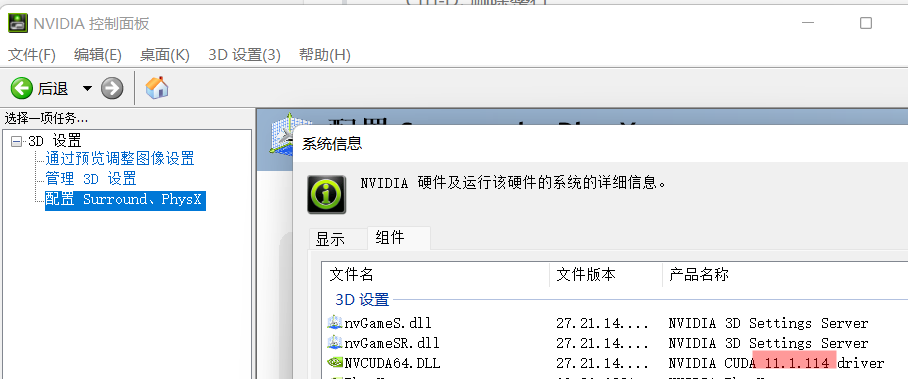
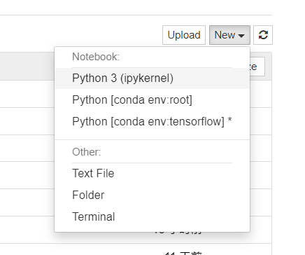

- lab1

  ```python
  import tensorflow as tf
  message=tf.constant("This is my first tensorflow sentence!")
  with tf.session() as sess:
      print(sess.run(message).decode())
  # with语句,隐式地关闭了会话
  # So,无需sess.close()
  
  ```

  > 前面的代码分为以下三个主要部分：
  >
  > - 第一部分 import 模块包含代码将使用的所有库，在目前的代码中只使用 TensorFlow，其中语句 import tensorflow as tf 则允许 [Python](http://c.biancheng.net/python/) 访问 TensorFlow 所有的类、方法和符号。
  > - 第二个模块包含图形定义部分...创建想要的计算图。在本例中计算图只有一个节点，tensor 常量消息由字符串“Welcome to the exciting world of Deep Neural Networks”构成。
  > - 第三个模块是通过会话执行计算图，这部分使用 with 关键字创建了会话，最后在会话中执行以上计算图。
  > - 请记住，每个会话都需要使用 close() 来明确关闭，而 **with 格式**可以在运行结束时**隐式关闭会话**
  >
  > 但对于我安装的tensorflow2.0, session会话执行方式已经被淘汰!
  >
  > 不需要再 使用会话对象来实现计算图的执行

- lab2:

  > 输出:print 1.+str(varible) / 2.'%s'%varible(有局限,仅有%d,%s,%f几种常用格式可选) 3. '{}'.format(varible)

  ````
  name = '小红'
  sex = '男'
  age = 18
  money = 20.56
  #错误拼接（报错显示：TypeError: must be str（字符串）, not int（整型））
  # print('你是'+ name +',性别为' + sex + ',年龄' + age)  
  #使用强制类型转换，进行拼接
  print('你是'+ name +',性别为' + sex + ',年龄' + str(age) + '，有' + str(money) + '钱')
  #使用占位符（%s、%d、%f）来进行输出,%s—>相当于str()，在底层代码中就进行了强制类型转换
  print('你是%s,性别为%s,年龄是%d，有%.2f钱'%(nam。e,sex,age,money))
  #采用format是字符串中的函数，’ '.format() 此处的‘.’是调用{}
  print('你是{},性别为{},年龄是{}，有{}钱'.format(name,sex,age,money))

- 调用numpy

  ```python
  import numpy as np
  a=tf.constant([[2,3,2],[2,3,4]])
  print("{}".format(d.numpy()))
  ```
  
  > numpy数学函数库,历史悠久,高性能,受欢迎,因而numpy格式能应用于大部分的数学套件
  >
  > tensorflow2.0中,**虽有Eager Execution模式能让tensor格式支持python基本运算**,但opencv&matplotlib等套件的api输入格式,可能会不支持tensor格式。因而当遇到数据类型错误问题时，最快的解决方法：将其**转化为numpy格式**
  
- lab3:计算梯度:假设损失函数为$w^2$

  ```
  w=tf.Variable([[1.0]])
  # 正向传播会被记录到"tape"中
  with tf.GradientTape() as tape:
      loss=w*w
      
  # 反向传播"tape"记录梯度
  grad=tape.gradient(loss,w)
  print(grad)
  ```

-  lab4: 利用keras,建立神经网络模型

  - 序贯模型(Sequential Model):

    > 搭建快速,可以解决绝大多数问题
    >
    > 基本只要是:回归问题or分类问题,都可以用序贯模型解决
    >
    > demerit:
    >
    > 搭建方法有限制,必须逐层搭建网络,且为
    >
    > 单输入输出模式(single input and output model)

  ```python
  
  import tensorflow as tf
  # TODO:ceshi from import yu zhijei1 import
  from tensorflow import keras as keras
  from tensorflow.keras import layers
  from tensorflow.keras.utils import plot_model
  from IPython.display import Image
  
  #搭建方法一:
  model=keras.Sequential(name='Sequential')
  #第一层需要定义输入尺寸
  #64:表示输出个数,即该层神经元的个数
  model.add(layers.Dense(64,activation='relu',input_shape=(784,)))
  model.add(layers.Dense(64,activation='relu'))
  #最后一层会被当作模型的输出层
  model.add(layers.Dense(10,activation='softmax'))
  
  # 产生网路拓扑图
  plot_model(model,to_file='Functional_API_Sequential_Model.png')
  
  # 显示出网路拓扑图
  Image('Functional_API_Sequential_Model.png')
  
  #搭建方法二:将所有网络层放入list(列表)中,作为tf.keras.Sequential的参数
  model=keras.Sequential([
      layers.Dense(64,activation='relu',input_shape=(784,)),
      layers.Dense(64,activation='relu'),
      layses.Dense(10,activation='softmax')
  ])
  ```

  

-  lab

  > keras:开源高级**深度学习API**,主要用于**快速搭建&训练网络模型**,本身并不具有计算能力,而是在**后端(backend)**:如 Tensorflow,CNTK,Theano等深度学习开源套件 上执行
  >
  >  
  >
  > Tensorflow2.0将Keras收纳为内建高级API,不安装Keras套件,通过tf.keras指令调用。tf.keras较Keras,能更为全面地支持支持Eager Execution、tf.data、TPU训练等

---------


- 认知

  - tensorflow

  > TensorFlow 是一个开源的、基于 Python 的机器学习框架，它由 Google 开发，并在图形分类、音频处理、推荐系统和自然语言处理等场景下有着丰富的应用，是目前最**热门的机器学习框架**。
  >
  > 这套 TensorFlow 教程对一些常见的**深度学习网络**进行了介绍，并给出了完整的实现代码，不仅适合初学者入门，也适合程序员进阶。
  >
  >  

  - 张量(tensor):矩阵向任意维度(dimension)的推广,tensorflow的运算都是基于张量完成的!

    > 0维张量称标量
    >
    > 1维张量称向量
    >
    > 2维张量称矩阵
    >
    > ```
    > import tensorflow as tf
    > tf.constant(1)
    > tf.constant([2,4,6])
    > tf.constant([[3,5,7],[2,3,4]])
    > 
    > ```
    >
    > 

  - flow(流):数据流动 or 计算

    > tensorflow通过尝试数据流图(计算图)进行运算 ，Node：表示数学运算，Edge：节点间的关联
    >
    > 1.x先产生计算机图，再执行计算图运算，此架构被称为“静态图”
    >
    > 2.0默认Eager Execution模式为执行模式,因此引入动态图机制,执行指令立即能得到回复。
    
  - numpy

    > 著名函数库

  - from tensorflow import keras和

    import tensorflow.keras的区别:

    > - from...import...**会在内存中创建并加载该模块工具的副本**，当有另外一个程序导入时，会在内存中创建另一个副本进行加载，**不会共用一个副本**，所以程序进行的修改不会影响到被导入的原模块，且不同程序之间不会互相影响。 
    >
    > - import...方法导入模块**会在内存中直接加载该模块的全部属性**。当出现多个程序导入该模块时,会共用一个模块，**程序之间会互相影响，包括原模块**。
    >
    > 总的来说：
    >
    > **1）import和from-import的显著区别**
    >
    > 
    >
    > 
    >
    > 前者访问副本,后者访问同一模块
    >
    > **2)当多个程序需要同时导入一个模块并且都是访问时,使用import 可以节省内存空间**
    >
    > **3）当多个程序需要同时导入一个模块当其中一个需要修改模块,那么修改的模块的程序应该使用from来导入模块**

    

    

    

    

    >  

    

    

- GPU(处理大量重复运算,结果无依赖性)

  > 为了解决CPU在大规模并行运算中遇到的困难， GPU应运而生，**GPU全称为Graphics Processing Unit**，中文为**图形处理器**，就如它的名字一样，图形处理器，GPU最初是用在个人电脑、工作站、游戏机和一些移动设备（如平板电脑、智能手机等）上运行绘图运算工作的微处理器。
  >
  > 
  >
  > 
  >
  > GPU采用数量众多的计算单元和超长的流水线，善于处理图像领域的运算加速。但GPU无法单独工作，必须**由CPU进行控制调用才能工作**。CPU可单独作用，处理复杂的逻辑运算和不同的数据类型，但当需要**大量的处理类型统一的数据时，则可调用GPU**进行并行计算。近年来，人工智能的兴起主要依赖于大数据的发展、算法模型的完善和硬件计算能力的提升。其中硬件的发展则归功于GPU的出现。
  >
  > 为什么GPU特别擅长处理图像数据呢？这是因为图像上的每一个像素点都有被处理的需要，而且每个**像素点处理的过程和方式都十分相似**，也就成了GPU的天然温床。
  >
  >  
  >
  >  
  >
  > GPU的工作大部分都计算量大，但没什么技术含量，而且要重复很多很多次。
  >
  > 
  >
  > 
  >
  > 借用知乎上某大神的说法，就像你有个工作需要计算几亿次一百以内加减乘除一样，最好的办法就是雇上**几十个小学生**一起算，一人算一部分，反正这些计算也没什么技术含量，纯粹体力活而已；而**CPU就像老教授**，积分微分都会算，就是工资高，一个老教授能顶二十个小学生，你要是富士康你雇哪个？
  >
  > GPU就是用很多简单的计算单元去完成大量的计算任务，纯粹的人海战术。这种策略基于一个前提，就是小学生**A和小学生B的工作没有什么依赖性，是互相独立的**。
  >
  > 但有一点需要强调，虽然GPU是为了图像处理而生的，但是我们通过前面的介绍可以发现，它在结构上并**没有专门为图像服务的部件**，只是**对CPU的结构进行了优化与调整**，所以现在GPU不仅可以在图像处理领域大显身手，它还被用来科学计算、密码破解、数值分析，海量数据处理（排序，Map-Reduce等），金融分析等需要大规模并行计算的领域。
  >
  > 
  >
  > 
  >
  > 所以GPU也可以认为是一种较通用的芯片。

  - TPU全称：Tensor Processing Unit, 张量处理器；

  > **万能工具的效率永远比不上专用工具。**
  >
  > google因此开发TPU（自研芯片），但目前基本只有谷歌，国内 腾讯云，华为云尚无相关服务器！
  >
  > 但GPU与CPU服务器都有，
  >
  > GPU服务器国内有，但目前价格极贵(上千近万)(同时性能也极强!128核)


### 关于我的AI实验 设备选择

> 吸取意见,以后跑NPL等模型(真心不难,应用场景也较小!真正难的,从来都是算法!)
>
> 推荐都在Atlas上跑!毕竟是零成本,直接用,conda,python,啥啥都已经给你配好了!
>
> 如果跑神经网络,是不能在虚拟机里跑的,它没有虚拟出一张显卡!!!
>
> 所以,以后:要么Atlas,要么电脑本机(不推荐),不要在虚拟机里跑! 
>
>  
>
> 两个产品的使用场景不一样。
>
> **jupyter 更多用于数据探索和算法设计阶段，你需要即时获得一段代码的结果，然后才知道后面的代码怎么编写**。
>
> **pycharm 则更加适用于工程化的项目，比如你要编写一个 python 库，或者编写一个 web 应用**，这个时候 pycharm 就会比 jupyter 好用很多。 
>
>  
>
> 个人是jupyter的铁杆粉丝，无论是用Python做机器学习，还是用scala写数据挖掘，我都是在**jupyter notebook上完成代码设计和测试，然后再跑集群任务**。减少环境部署困难是一个小的方面。对我来说，最重要的原因是，使用**jupyter可以在写编码和调试时获得最密集最实时的反馈**，有任何问题插入一个cell写几行代码测试一下，真正是测试驱动编码有木有，真正是**人机实时互动**有木有？ 
>
>  
>
> [苦逼学生党的Google Colab使用心得](https://zhuanlan.zhihu.com/p/54389036)


### windows上,Anaconda与Jupyter notebook的使用

- 利用conda进行环境切换

> ==**conda查看子环境依赖**==
>
> ```
> conda list
> # packages in environment at /home/HwHiAiUser/archiconda3/envs/yolov5:
> 
> ```
>
> 
>
> ==Anaconda下查看已经创建了哪些环境==
>
> ```
> conda info --env
> ```
>
> 创建环境
>
> ```undefined
> conda create -n rcnn python=3.6
> ```
>
> 删除环境：
>
> ```
> conda remove -n rcnn --all
> ```
>
>  
>
> ```
> conda list
> conda create -n yolov5 python=3.8
> conda activate yolov5
> ```
>
> 


Jupyter快捷

> **命令模式:**
>
> Enter: 进入编辑模式
>
> F: 查找并且替换
>
> Shift-Enter: 运行单元格, 选择下面的单元格
>
> Ctrl-Enter: 运行选中的单元格
>
> Alt-Enter: 运行单元格并且在下面插入单元
>
> Y: 把单元格变成代码快
>
> M: 把单元格变成 Markdown
>
> 
>
> 1: 把单元格变成标题 1
>
> 2: 把单元格变成标题 2
>
> ...
>
> Ctrl-A: select all cells
>
> X: 剪切选择的单元格
>
> C: 复制选择的单元格
>
> V: 粘贴到下面
>
> Z: 撤销删除单元格
>
> D,D: 删除选中单元格
>
> 
>
> Ctrl-S: 保存并建立检查点
>
> S: 保存并建立检查点
>
> H: 显示键盘快捷键
>
> ----
>
> **代码模式:**
>
> Ctrl-D: 删除整行
>
> Tab: 代码补全或缩进(长按,显示所有)
>
> Shift-Tab: 工具提示
>
> 
>
> Ctrl-上: 跳到单元格起始处
>
> Ctrl-下: 跳到单元格最后


- **Anaconda安装后的工具链:**

  IDE:Pycharm,工程性文件;

  [在pycharm里面配置anaconda环境](https://blog.csdn.net/WL1234567891/article/details/120434216)

  Jupyter:小量级代码(交互式)


- 

-----

### **windows上安装TensorFlow的全过程:**

过程参照:

[【最新】手把手教你Windows安装TensorFlow-gpu2.1.0（2021.6.11更新）](https://blog.csdn.net/MUKCHAN/article/details/117826907)(它是Cuda10.0版本)

[windows11，安装cuda11.0+cudnn8.0记录](https://blog.csdn.net/qq_49641239/article/details/112389779)


> 安装Anaconda(自带python3.9&Jupyter&很多自带的库)-->
>
> 查看NVIDDIA Cuda版本:11.1-->
>
> 
>
> 
>
>  
>
> -->安装对应的Cuda-toolkit11.2(for CUDA 11.0,11.1 and 11.2)
>
>  https://developer.nvidia.com/rdp/cudnn-archive
>
> 
>
>  
>
> -->正式安装TensorFlow
>
> ```
> pip install tensorflow-gpu=2.4.0 -i https://pypi.doubanio.com/simple/
> ```
>
>   
>
> ```
> pip install --upgrade tensorflow-gpu==2.4.0
> ```
>
> 
>
> conda中,尽量使用conda install,conda找不到再使用pip install


--------

**针对Jupyter不支持conda虚拟环境:**

场景:

tensorflow(框架)安装在了tensorflow(conda环境名)环境下

jupyter notebook每次启动,都只能进入base环境,且无法使用conda activate tensorflow来切换环境。

解决方法：使用nb__conda插件!


1.设置代理(不然install老是显示错误)

```
set http_proxy=http://127.0.0.1:7891
```

2. conda activate tensorflow

   ```undefined
   conda install nb_conda
   jupyter notebook #启动jupyter notebook
   ```


成功:




-----


```
tensorflow_gpu-2.4.0	3.6-3.8	MSVC 2019	Bazel 3.1.0	8.0	11.0
```


-----

Tensorflow:矩阵向任意方向的推广


1. database上课(&追赶知识点) -->6:00
2. 准备口语,8:00进行答题(回寝室)7:00-->8:00
3. 小程序 8:30-->10:00
4. tensorflow

OS!

数值分析(追赶)(**今晚!**)

阶段性的目标,也许更有用!

每日一个主题:今日?小程序!


-----


