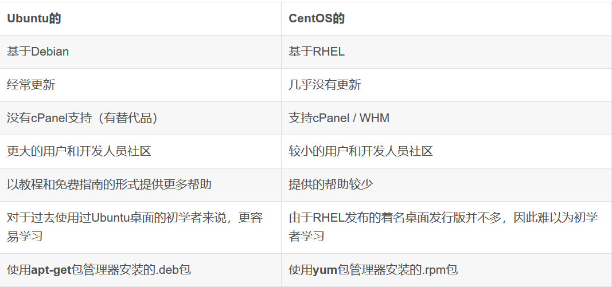
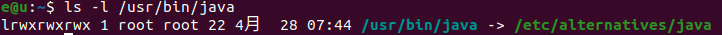
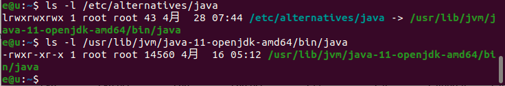
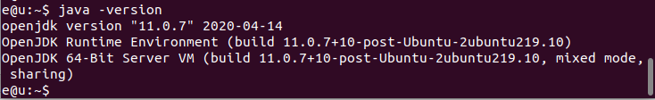
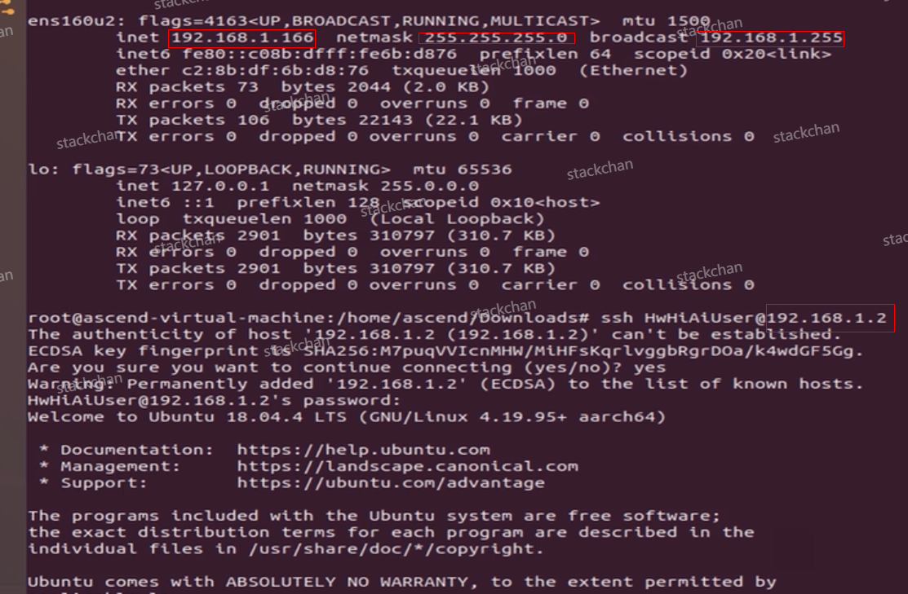
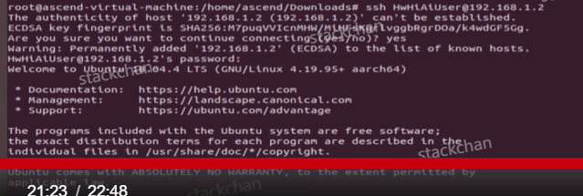
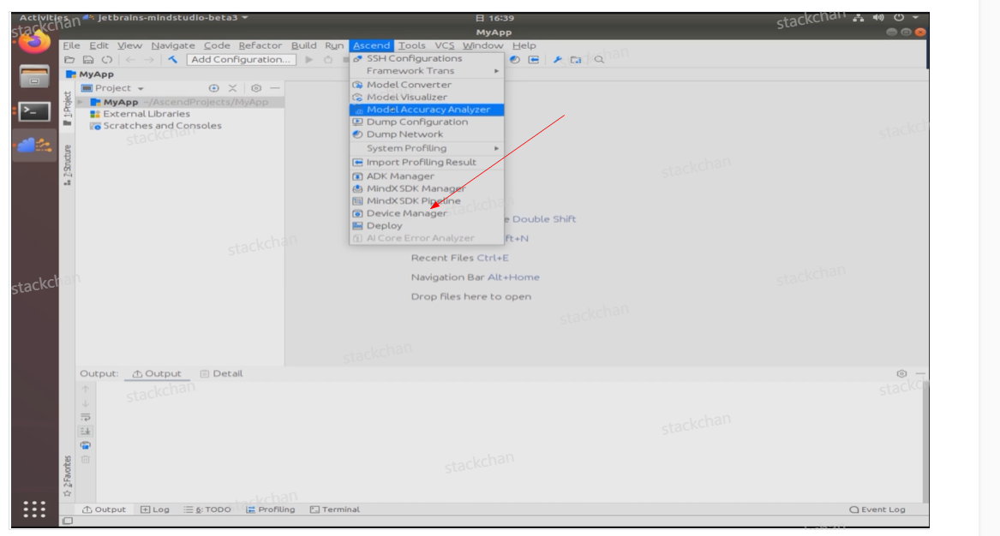
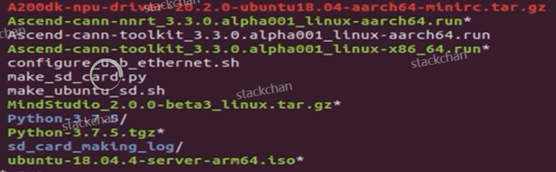
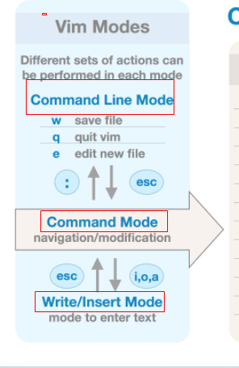

[toc]

# 写在前面

> 不摘录无意义的基础原文
>
> 基本知识点:
>
> - Linux 常用命令
> - 用户与权限管理
> - 目录结构与文件操作
> - 环境变量，计划任务，管道与数据流重定向
>
> 常用版本:
>
> - Ubuntu(个人常用)
>
> - CentOs(企业常用)
>
>   
>
>  (Ubuntu是压倒性的主流,但[runoob.com](https://www.runoob.com/linux/linux-tutorial.html)使用了CentOs作为示教) 
>
> 


# 一. linux文件系统

系统启动所需

- /boot 启动Linux使用的内核文件(连接文件&内核文件included)
- /ect 系统所需 配置文件&子目录文件
- /lib 基本代码库(eg.C++库)
- /sys Linux2.6内核的新变化,是内核设备树的直观反映,每当一个内核对象被创建,对应的文件和目录也在该目录中被...(何谓**内核对象**?)

指令集合

- /bin 二进制文件,常用的 程序&指令
- /sbin 只有root用户能使用的bin

外部文件管理

- /dev   存放Linux外设,[Linux一切皆文件,举例声卡:open()打开声卡设备， read() 就是录音， write() 就是播放](https://www.jianshu.com/p/39668c5436f9)
- /media 类windows的其他设备,是linux识别的设备,如U盘,光驱
- /mnt 临时挂载的文件系统,打开wsl的/mnt,可以看见windowns的文件系统映射

临时文件

- /run 存储启动启动依以来的信息
- /lost+found 一般为空,系统非法关机则存放一些文件
- /tmp 用来存放一些临时文件

账户

- /root root用户主目录
- /home 用户主目录,(/stack,jack,bob)
- /usr 用户的很多应用程序和文件放在这个目录下

运行过程中使用

- /var 经常修改的文件,如/log
- /proc 管理内存空间,系统内存的映射(so it's virtual),直接访问该目录可获取系统信息

拓展用

- /opt,默认为空,安装额外软件时可放此处
- **/srv**：存放服务启动后需要提取的数据**（不用服务器就是空）**


# 二. linux常用指令


- 带着问题:
  1. 使用sudo命令安装新的程序时,其是否是自动安装到/opt,不需要指定
  2. .bashrc(.表示隐藏目录,默认显示条件下不显示)使用?
  3. 


右Ctr+C退出独占模式!!!

1. C,d盘均不能访问,大概率是VirtualBox设置问题;对照视频,得知正常
2. 尝试3.0,2.0,1.0 均失败

我与它的最大区别:无

其他解答?

1. 挂载方案

   

   Uncompressing ASCEND_RUN_PACKAGE

extract Ascend-cann-nnrt_5.0.4.alpha005_linux-aarch64.run failed. please check this package.


10:20


[配置网络连接](https://support.huaweicloud.com/environment-deployment-Atlas200DK1012/atlased_04_0012.html)章节已介绍了如何实现Atlas 200 DK与PC机进行通信，并将Atlas 200 DK接入互联网的配置方式，若您的Atlas 200 DK无条件接入互联网，您可以参见本章节进行连接 ，仅实现Atlas 200 DK与用户PC机的通信。需要注意，此种场景下，Atlas 200 DK仅适合作为运行环境。

我未实现网络连接,而把Atlas 200 DK仅作为运行环境,将PC作为开发环境,仅实现Atlas 200 DK与用户PC机的通信


sudo apt-get install -y gcc g++ make cmake zlib1g zlib1g-dev openssl libsqlite3-dev libssl-dev libffi-dev unzip pciutils net-tools libblas-dev gfortran libblas3 libopenblas-dev(不太对的,貌似找错了)

sudo yum install -y gcc gcc-c++ make cmake unzip zlib-devel libffi-devel openssl-devel pciutils net-tools sqlite-devel lapack-devel openblas-devel gcc-gfortran


pip3 install attrs numpy==1.17.2 decorator sympy cffi pyyaml pathlib2 psutil protobuf scipy requests


sudo yum install -y unzip zlib-devel libffi-devel openssl-devel pciutils net-tools sqlite-devel lapack-devel openblas-devel gcc-gfortran


cd Python-3.7.5


./configure --prefix=/usr/local/python3.7.5 --enable-loadable-sqlite-extensions --enable-shared


make

sudo make install


pip3 install attrs numpy==1.17.2 decorator sympy  cf pyyaml pathlib2 psutil  protobuf scipy requests


15:18


/////

root@stack-VirtualBox:/home/stack/Downloads/Python-3.7.5# python3 --version
Python 3.7.5

#Python3版本终于正确了!!!

python3_install_path=/usr/local/python3.7.5


---

\2. 查看路径

```
which java
```


 

 ls -l /usr/bin/java 看看这是否是个软连接，找出这个软连接指向的路径

```
ls -l /usr/bin/java
```



的确为软连接，继续往下找指向的路径



 至此，java 的安装路径即为 /usr/lib/jvm/java-11-openjdk-amd64/bin/java

 

3、配置 java 环境

```
vim /etc/profile
```

在弹出的 vim 编辑器中输入

```
# JAVA ``JAVA_HOME==/usr/lib/jvm/java-11-openjdk-amd64``PATH=$JAVA_HOME/bin:$PATH``export JAVA_HOME PATH
```

esc 退出编辑模式，输入 :x后，单击回车退出。

在终端输入

```
source /ect/profile
```

 使之前的配置生效。

 

4、 验证

java -vesion



$JAVA_HOME/bin/java -version


----

```
JAVA_HOME=/usr/lib/jvm/java-8-openjdk-amd64
JRE_HOME=$JAVA_HOME/jre
PATH=$PATH:$JAVA_HOME/bin:$JRE_HOME/bin:$PATH
CLASSPATH=.:$JAVA_HOME/lib/dt.jar:$JAVA_HOME/lib/tools.jar:$JRE_HOME/lib:$CLASSPATH
export JAVA_HOME JRE_HOME PATH CLASSPATH
```


---


**~/.bashrc 配置环境变量的做法**

[安装jdk,jre并配置环境变量](https://blog.csdn.net/jcfszxc/article/details/88728836)


我们经常在linux要查找某个文件，但不知道放在哪里了，可以使用下面的一些命令来搜索： 
    which 查看可执行文件的位置。
    whereis 查看文件的位置。 
    locate  配合数据库查看文件位置。
    find  实际搜寻硬盘查询文件名称。

```
该指令会在特定目录中查找符合条件的文件。这些文件应属于原始代码、二进制文件，或是帮助文件。

该指令只能用于查找二进制文件、源代码文件和man手册页，一般文件的定位需使用locate命令。
```


which命令的作用是，在PATH变量指定的路径中，搜索某个系统命令的位置，并且返回第一个搜索结果。也就是说，使用which命令，就可以看到某个系统命令是否存在，以及执行的到底是哪一个位置的命令。 

---

1. ifconfig,无期待结果: 因:virtualbox未配置;配置方法如故;连接成功
2. 运行configure_usb_ethernet.shsh脚本(Downloads目录下)


# [Linux中bash的一些命令](https://www.cnblogs.com/z0909y/p/10043404.html)

Linux——bash的简单使用

bash及其特性：

1、bash实质上是一个可执行的程序，一个用户的工作环境。

2、每一个shell下可以再打开一个shell，新打开的shell称为子shell，每一个shell之间相互独立。

3、可以使用pstree命令查看当前shell下的子shell个数


---



192.168.1.166是你ubuntu的ip地址

192.168.1是200DK的Usb接口与你的ubuntu相连时的用的网段 

而200DK的Usb接口的ip地址是:  192.168.1.2

200DK的网线接口的ip地址192.168.0.2(我使用了Usb,所以是192.168.1.2)


连上200DK:

(如果是网线,换成192.168.0.2)

ssh HwHiAiUser@192.168.1.2

默认用户名:HwHiAiUser

密码:Mind@123

过了:



可以看到终端已经变成了....-mini的用户,说明成功连上了200DK上的Ubuntu!!!


怎么让MindStudio配上200Dk的地址呢?




----

Atlas配置过程中出场过的所有包:




---------

**wsl2性能优越**

wsl2(无论是通过Microsoft Store,从而由windows全权管理),还是直接下载,自主安装,都已经实现了完整的Ubuntu的linux内核(虽然wsl没有完全实现).且wsl2(无论通过Microsoft Store安装还是直接安装)在性能上,都与Ubuntu单系统(注意:非虚拟机,因为此三者性能完爆虚拟机)差距极小,甚至部分方面由于Microsoft的优越功能(如电源管理),更胜过一筹(如更省电),超过了Ubuntu.由此,wsl+windows被称为最好的linux发行版.但wsl2仍然是基于虚拟机的,只不过与windows结合好,易于安装,易于管理.wsl2与wsl性能方面最显著的还是吞吐量,wsl已然丝毫不逊与Ubuntu.

**wsl不支持USB,除非安装一个开源程序(较为麻烦,使用案例极少,有风险)**

一些物理设备通常通过 USB 连接到计算机，但我们发现无法使用 WSL 在 Linux 上测试我们的工具，因为它==(wsl)不支持 USB==。我们并不孤单——社区也强烈要求支持将物理 USB 设备连接到 WSL。[来自windows社区]

Support for connecting USB devices is not natively available in WSL, so you will need to install the open-source usbipd-win project.[来自Microsoft Doc](https://docs.microsoft.com/en-us/windows/wsl/connect-usb) ,并且它提供了一个开源软件来满足必须实现这一功能的人!


**wsl2+xorg+xfce的Ubuntu UI化原理(注意:并非Ubuntu能UI化,别的也行,知识Ubuntu稳定性能好,常作为linux代表)**

X[窗口系统](https://www.zhihu.com/search?q=窗口系统&search_source=Entity&hybrid_search_source=Entity&hybrid_search_extra={"sourceType"%3A"answer"%2C"sourceId"%3A669568568}):X Window System.这是MIT 1984年提出的以位图图像显示图形化界面的一套软件规范及协议.

而X Window System使用最广的软件实现是Xorg.我的wsl中安装了Xorg,使得它有了图形化的可能

但是目前没有实现Linux的显卡驱动功能,因此即使WSL中安装了Xorg,也会不能启动.

**要想使用WSL显示GUI,必须要利用X window可以使用网络远程显示的特性,**在Windows可以使用GUI的子系统win32中安装X server

[参考:xsl2+xorg+xfce的Ubuntu UI化原理](https://www.zhihu.com/question/321725817)

而xfce提供了 窗口管理器(如:最大化,最小化,分辨率...),显示管理器,文件管理器(此三者都在使用xfce过程中看到了)等功能

在Ubuntu中安装了xorg,xfce4服务后,使用远端界面直接显示,或是再安装一个xlaunch软件来更方便显示,都是可以的


--

必然可以更新

1. 更新
2. 重新检查对应toolkit,是否是对应版本


```
sudo apt-get install -y libbz2-dev libxslt1-dev libncurses5-dev libncursesw5-dev   libbz2-dev libxslt1-dev libncurses5-dev libncursesw5-dev
```

sudo apt-get install -y lilibbz2-dev libxslt1-dev libncurses5-dev libncursesw5-dev


tar zxvf ...


----

问:

云边端 案例?

1. 现在已经能够实现

   - > - [Atlas200DK-开发环境和运行环境合设分设](https://gitee.com/lovingascend/quick_start/blob/master/Atlas200DK_separate_MD/README.md)(我实现了分设,一下论述均参考:[Atlas200DK快速入门](https://bbs.huaweicloud.com/forum/thread-71262-1-1.html))
     >   我的环境：
     >   1.开发侧：ubuntu18.04虚拟机
     >   2.运行侧：Atlas200DK开发者套件
     >
     >   优点：
     >   使用Mindstudio开发，交叉编译为能够**在Atlas200DK上运行的可执行程序后，推送到设备侧运行**，代码编写编译等效率高。
     >
     >   Atlas 200开发者套件又称Atlas 200 Developer Kit，是以Atlas 200 AI加速模块为核心的开发者板形态的终端类产品。主要功能是将Atlas 200的接口对外开放，方便用户快速简捷的使用Atlas 200作为算力支持
     >
     >   (如果合设,则 无法使用Mindstudio（无法使用Mindstudio（MindStudio暂不支持arm+ubuntu），代码编写编译等效率较低，对使用者Liunx技能的要求较高。)

   

2. 对于其**云边端协同**过程,我是较为陌生的

   1. 我的PC作为开发设备,project成功部署到Atlas上,Atlas启动,没有点击,怎么自动启动那个程序 并 让它达到和人输入一些指令的效果呢?(这就是所谓的黑窗口编程,高手才能做到的了;应该是通过预先编好的bash,.sh,.dll 来实现的) -->查询案例
   2. 

   

   > 
   >
   > 

   - 获取一个不需要设备支持的案例,仿照其,把雷达部署到Atlas上!!!

3. 我的应用场景

4. 


Atlas使用文档

MindStudio使用文档

网上Atlas or 雷达 or MindStudio资源


连上了Atlas上的Ubuntu系统,和正常的linux没区别;而MindStudio则可以极大程度上方便我们:

确认是否:

1. 点击convert to ascend project,能使它在Ascend上跑(毕竟我们是要摆脱黑窗口编程的)
2. 


----

[Ubuntu18.04 永久修改DNS ](https://blog.csdn.net/qq_38491310/article/details/86494635)解决了Atlas上ping baidu.com不通的问题

[华为Atlas无法直接连接wifi,必须要网线](https://blog.csdn.net/devcloud/article/details/103361268)

[华为Atlas官方文档提供的两种连接网络的方法](https://support.huaweicloud.com/environment-deployment-Atlas200DK1012/atlased_04_0012.html#ZH-CN_TOPIC_0000001172355029__section201421540103210):1. 连接路由器  2. 连接PC,通过网络共享方式连接(必须要有网线)

PC机不可能,只有可能连接路由器,[华为Atlas无法直接连接wifi,必须要网线](https://blog.csdn.net/devcloud/article/details/103361268)提供了通过小型路由器(利用其中继功能)连接wifi的方案!路由器也需要电源,如此是真的麻烦!


----

现在Atlas仍然存在的问题?

1. 转换成...失败;因:版本问题,需要降低cnkk的版本以期适配
2. 完成后,必定能!
3. 此后的开发可能仍然需要200DK联网
4. **雷达代码的部署,有一定问题!!!**
5. 


反省:

耗时主要在:

选用wsl2贪小便宜,但wsl2不支持usb设备连接,最终浪费更多时间(一开始就应该和它一样)-->使用Virtualbox+Ubuntu,成功解决

java,jre版本不对(可能解决方案有很多,错在自己没有一口气列出来,然后迅速逐一尝试,而是不断重复同一种解决方案,在现有解决方案未被尝试完前,断然去寻找新的解决方案)-->java安装java11,成功解决

Ubuntu空间内存不够,解决方案有卸载多余文件,按照网络方式拓容等(错在未一开始就搜谷歌,谷歌直接出来了一个针对固定内存分配的方案;错在一开始选在了空间受限的D盘,导致了空间不足的问题)-->virtualbox固定内存拓容方案完成,成功解决

MindStudio "invalid Ascend toolkit",又是版本问题!(错在一开始未按照其指定版本安装,未重视 说明文档)

(平均每个问题耗时2天,因未及时抽调时间抓紧解决,而是一拖再拖,导致了而今悲剧!!!==拒绝拖延症,完成任务,吸取教训==大过天)

总结:

1. 一开始就要全线 ==保持一致== (Ubuntu存储空间大小分配一致,使用virtualbox而非wsl2),重视版本问题
2. 一开始就要重视 ==说明文档+谷歌== 的开发工具链,重视版本匹配
3. 列出解决方案,迅速逐一完成尝试,并记录 尝试结果,不做无用功!!(==有序化测试实验==)
4. 最最重要的是,如果你一开始就 ==不拖延== ,何至于今日?


--------

**Current**

1. toolkit版本回退,nnae以后再说

toolkit安装失败,可能设置原来安装过程中的环境配置问题;参照windows2完成安装,windows3完成测试;8:00前布局完成

尝试布局雷达:1.200DK与雷达连接,查看能否查找到设备?你也看不了啊!所以,直接雷达直接连电脑, MindStudio上尝试跑代码(难)

然后,进入问题榜3(必今晚!!!)

**周五&周六,激光雷达检测物体靠近的算法**(开始慌了)


---


问题榜:

1. Atlas连上雷达,则必不可能与电脑连接,即问题3;故此,当前涉及这方面的都延后讨论 (前期关注,==今晚解决==)
2. 蓝牙模块无,无线网(wifi)连不上;Atlas必须通过 一个小的路由器实现与手机的通信(后期关注)
3. Atlas与雷达,摄像机等设备连接,它的指令下发,程序启动,需要以何种形式完成,才能让华为Atlas独立运行?不管 开发环境and运行环境 合设or分设,都必须通过.dll,.sh,.bash等脚本形式,来实现其启动(后阶段关注,没有电脑情况下,可以吗?这方面树莓派能提供较大参考,先看树莓派文档,再与杨富超讨论)
4. 


---

待会楼下看图!!!

linux bash:

> Shell 英文名叫“壳”,是一个**处理用户请求**的**工具**或接口，它负责**解释用户输入的命令**，**调用**用户希望使用的程序。

用户与硬件交流:

用户输入命令-->Shell--> Linux-Kernel（Linux内核）-->计算机硬件

>  [linux](https://so.csdn.net/so/search?q=linux&spm=1001.2101.3001.7020)中.sh文件是***\*脚本文件\****，一般都是bash脚本。
>
> 执行命令: ***\*./hello.sh\**** or ***\*sh hello.sh\****  单要有执行权限,ll确定权限,chmod -u +x hello.sh 更改权限,*u*代表所有者, *x*代表执行权限。 整体表示增加权限。(r读,w写,x执行)


> linux 中在shell中可以使用 " . (.后带空格)" 和 " ./ " 执行，[例子参照](https://blog.csdn.net/u014471752/article/details/84565908)
>
> > 1. " ./ “ 的方式类似于新建了一个shell， 在这个新建的shell中去执行脚本中的程序，类似于**新建了一个子进程，但这个子进程不继承父进程的所有非export类型的变量**，并且脚本中对非export环境变量的创建或修改不会反馈到外部调用shell中
> >
> > 2. ” . " 的方式类似于将脚本中的每一行指令逐条在当前shell中执行，因此它继承了当前shell的环境变量，同时脚本中对环境变量的修改也可以反馈到shell中
>
> stack@stack-VirtualBox:~$ 
>
> $表明是非root用户登录,#表示是root用户登录；
> ~表示当前位置为用户的目录

> 
>
> 
>
> echo 语句的功能是把 echo 后面的字符串输出到标准输出中去


- Vim的三种模式:

  > 
  >
  > Command Line Model, :启动
  >
  > Command Model, Esc启动,直接输入 w i o a 等字母;关键:**Y:copy  y:copy p:粘贴 u:撤销  ctr+r反撤销  ctr+n自动补全(第二次输入时自动补全)  v:visual model ctr+v:visual block model(移动光标以选中)**  dd:删除整行 delete=d=x:删除光标所在 (删除当前光标的前一行,可以用i启动insert模式,再backspace)  Home/End:移动到行首行尾 
  >
  > /xx  查找xx,使用n向下移动,N向上移动
  >
  > 
  >
  > Write/Insert Model
  >
  > > 命令模式(Command Mode)只有一些最基本的命令，因此仍要依靠底线命令模式(Command Line Model)输入更多命令
  > >
  > > :w等,Command Line可以使用的命令非常多
  >
  >  

- 文件

  > - 当为 **d** 则是目录
  > - 当为 **-** 则是文件；
  > - 若是 **l** 则表示为链接文档(link file)；

- Linux快捷键 & 常用命令

  > ctr+l清屏   
  >
  > touch 文件名 :创建文件
  >
  > rm (-f) 文件名 :删除(加-f忽略是否存在,直接删除)文件
  >
  > ll -lh大小显示更好看(自动调整文件大小的单位)
  >
  > pwd
  >
  > Ctrl+Z:暂停挂起,按fg(foreground,把后台运行或被挂起的程序切到前台继续运行)能继续   Ctrl+C:中断
  >
  > pwd
  >
  > （4）复制粘贴
  >
  > Ctrl+Ins：复制  or ==Ctrl+Shift+C(推荐)==
  >
  > Shift+Ins：粘贴  or  ==Ctrl+Shift+C(推荐)==


---------

如果出现多个 

可视化界面中,对于(read-only)只能读的文件  可以用sudo gedit一般都能行(root用户总是)修改  当然用vim也行,用chmod的话,毕竟会造成长久影响,不太好  (777三组权限,分别是 文件所属用户 该所属用户所在用户组用户  其他用户的权限,不包括root用户,  而对于root用户,所有权限都有)


-----


注意系统用户和普通用户啊


