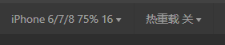

app.json中,  page index.

微信支持rpx尺寸单位,针对不同屏幕能自动换算	

WXSS仅支持部分CSS选择器:

- .class(类选择器)和#id(id选择器)
- elemnt(元素选择器)
- 并集选择器/后代选择器(.container1 view, 类名选择器+后代选择器)
- ::after和::before等伪类选择器

小程序启动顺序:

- 把小程序代码包下载到本地
- 解析app.json全局配置文件
- 执行app.js小程序入口文件,**调用App()创建小程序实例**
- 渲染小程序首页
- 小程序启动完成(渲染完成后,会有onlaunch()方法执行)

单页面渲染过程:

- 加载解析页面的.json配置文件
- 加载页面的.wxml模板 和 .wxss样式
- 执行页面的.js文件,**调用Page()创建页面实例**(???)
- 页面渲染完成

