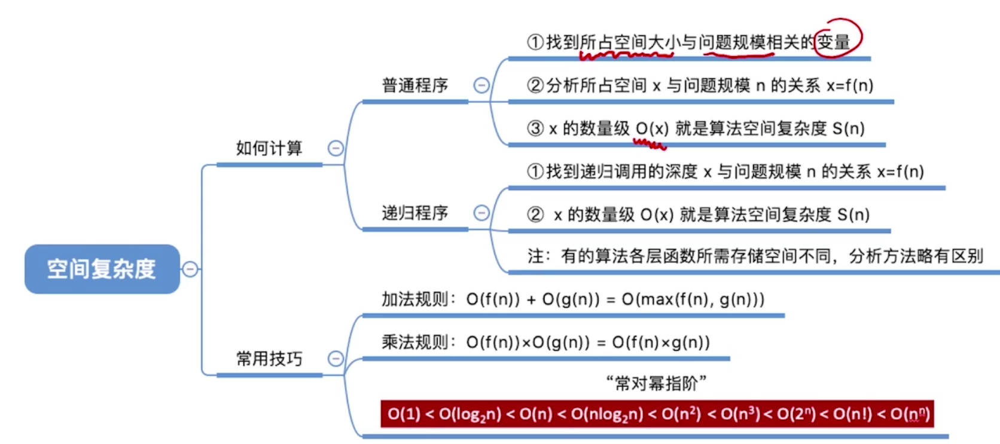

[toc]

# Chapter1:绪论

## 

- 最大困惑

  > 系统程序员,机器语言,数字长序列为主,解释为主1) 内核层

- 解释

  > ### 1) 内核层
  >
  > 内核层是 UNIX/Linux 系统的核心和基础，它**直接附着在硬件平台**之上，控制和管理系统内各种资源（硬件资源和软件资源），有效地组织进程的运行，从而扩展硬件的功能，提高资源的利用效率，为用户提供方便、高效、安全、可靠的应用环境。
  >
  > ### 2) Shell层
  >
  > Shell 层是与用户直接交互的界面。用户可以在提示符下输入命令行，由 Shell 解释执行并输出相应结果或者有关信息，所以我们也把 Shell 称作命令解释器，利用系统提供的丰富命令可以快捷而简便地完成许多工作。
  >
  > ### 3) 应用层
  >
  > 应用层提供基于 X Window 协议的图形环境。X Window 协议定义了一个系统所必须具备的功能（就如同 TCP/IP 是一个协议，定义软件所应具备的功能），可系统能满足此协议及符合 X 协会其他的规范，便可称为 X Window。
  >
  > 现在大多数的 UNIX 系统上（包括 Solaris、HP-UX、AIX 等）都可以运行 CDE （Common Desktop Environment，通用桌面环境，是运行于 UNIX 的商业桌面环境）的用户界面；而在 Linux 上广泛应用的有 Gnome（见图 4）、KDE 等。

  > 平常我们接触的是应用层,或者shell(壳)层,偶尔也会用到shell命令(可以被称为语言,有点像助记符,可仍然不是汇编语言)
  >
  > 而内核层是直接附着在硬件平台的,直接接触底层,有机器语言,有偏上层的汇编语言,它的部分位于操作系统层执行操作系统层的工作,部分位于其它层执行其他工作
  >
  > 总的来说,我们见到的操作系统(Unix,Linux,iOS,Windows,各种嵌入式小系统...)是很杂的概念,涵盖了许多层的功能,与硬件层的关系紧密程度也不同,有些小系统甚至只能依附与特定的硬件系统,在其他系统上无法运行
  >
  > 软硬件也是不可分的,没有明确界限.比如指令系统层的诸多指令,有的按照电路直接执行,有些要经过微程序解释后执行(不过现在这方面的指令很多已经通过微体系结构层的硬件设计改为可以直接执行的指令了)
  >
  > 

## Chapter2:概述

- 上图:
- 常对幂指阶
- 

