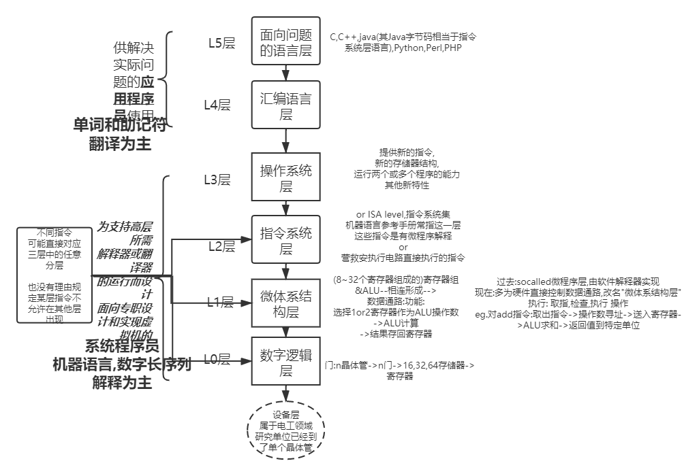
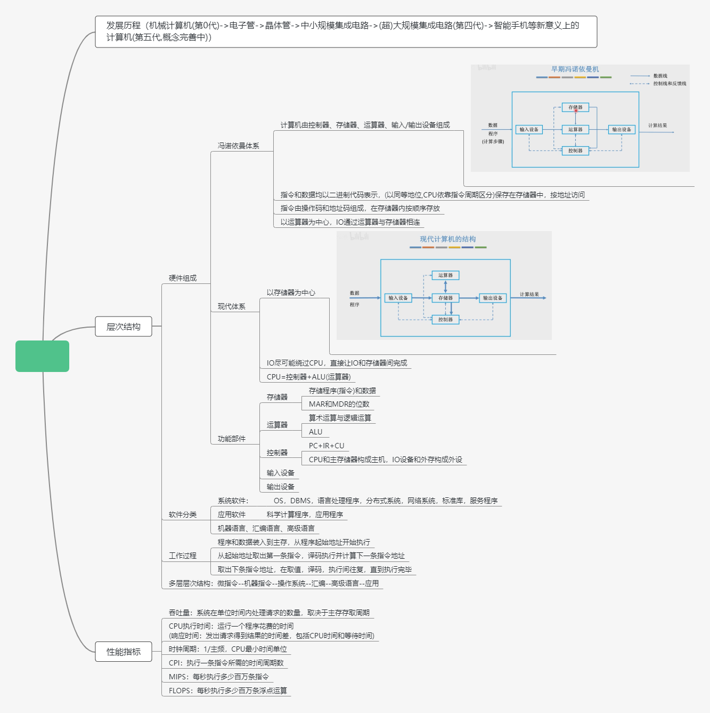
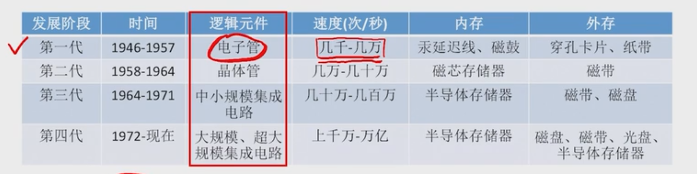
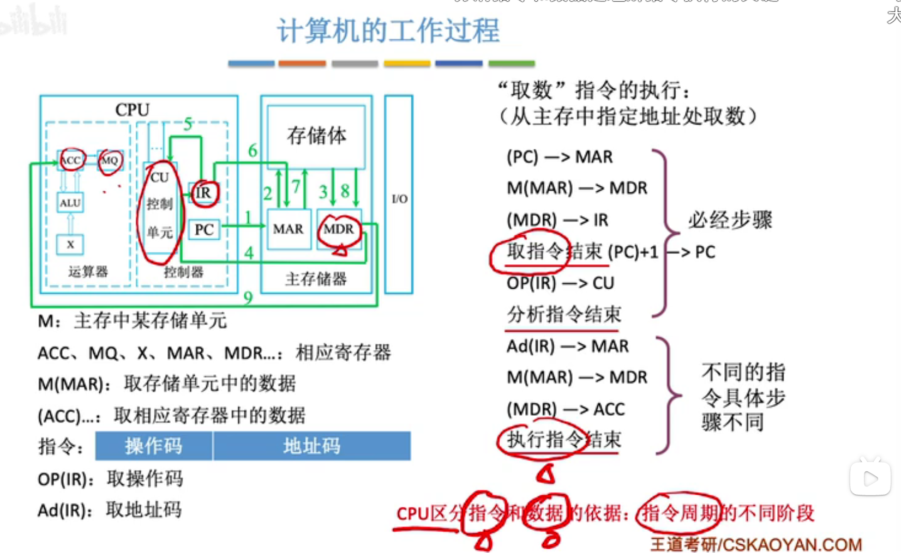
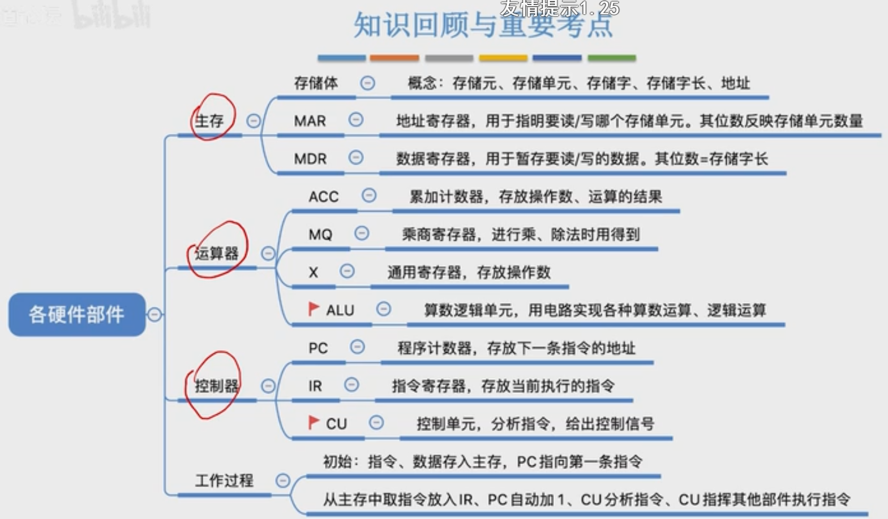

[toc]

# 写在前面

## 1. why?:为什么要选 计算机组成-结构化方法 ,其与常规高校教材的区别与优势

**常规高校教材知识结构(含NEU):**

*   [第一章 计算机系统概述](#)
*   *   [知识网图](#)
    *   [冯诺依曼机的特点：](#)
    *   [不同级别的语言：](#)
    *   [计算机的工作过程：](#)
    *   [计算机的性能指标：](#)
*   [第二章 数据的表示和运算](#)
*   *   [知识网图](#)
    *   [在计算机系统内部，所有信息都用二进制进行编码的原因有以下几点：](#)
    *   [有符号的机器表示](#)
*   [第三章 存储系统](#)
*   *   [知识网图](#)
    *   [DRAM刷新方式](#)
    *   [程序访问的局部性原理](#)
    *   [虚拟存储器程序的执行过程](#)
    *   [快表](#)
    *   [虚拟存储器与Cache的比较](#)
*   [第四章 指令系统](#)
*   *   [知识网图](#)
    *   [常见指令寻址方式的特点及适用情况：](#)
    *   [CISC与RISC特点](#)
    *   [与CISC相比，RISC的优点：](#)
*   [第五章 中央处理器](#)
*   *   [知识网图](#)
    *   [CPU的具体功能](#)
    *   [控制器的工作原理](#)
    *   [控制器的主要功能](#)
    *   [CPU的控制方式](#)
    *   [硬布线控制单元设计步骤：](#)
    *   [硬布线和微程序控制器的特点](#)
*   [第六章 总线](#)
*   *   [知识网图](#)
    *   [总线传输的4个阶段](#)
*   [第七章 输入/输出系统](#)
*   *   [知识网图](#)
    *   [程序查询方式的工作流程](#)
    *   [程序中断的作用](#)
    *   [中断处理流程](#)
    *   [DMA方式与中断方式的区别](#)

**本书结构**:

[TOC]

**优势:**

> 本书采用结构化方法来介绍计算机系统，书的内容完全建立在“计算机是由层次结构组成的，每层完成规定的功能”这一概念之上。作者对本版进行了彻底的更新，以反映当今最重要的计算机技术以及计算机组成和体系结构方面的最新进展。书中详细讨论了数字逻辑层、微体系结构层、指令系统层、操作系统层和汇编语言层，并涵盖了并行体系结构的内容
>
> 结构化是计算机组成知识体系的核心,该书契合七层结构中的底下几层,相比常见高校教材对计算机原理的直接分块阐述,该书分层深入阐述,更具体系化与结构化特征.对于网络原理的学习大有裨益.且网络中缺乏对该书的系统总结,因而成为我的首选.

## 2. how?:如何分析这种结构化分层结构,熟悉本书

> 该书正文有六大部分,其实可以分为两个大类，
>
> - 一是计算机网络和数据库；
> - 二是计算机组成、操作系统、算法、数据结构。

>  **计算机组成**告诉你**硬件能做什么**，
>
> **操作系统**告诉你它是如何管理这些硬件并提供给外部(上层)接口来使用。
>
> **算法和数据结构**告诉你如何高效、简洁的的使用这些接口以便达到最合理的使用硬件和尽可能的有利于软件开发。

>  一定要理解计算机系统设计的分类和分层(你理解了之后就会知道这句话是什么意思)〔不要对硬件细节抠的太仔细，一切都从整体来看〕。接着看操作系统原理，我认为操作系统的两大难点是
>
> - 虚拟内存管理、
> - 进程调度和通信，而且与编程关联比较密切。

> 本书采用结构化方法来介绍计算机系统，书的内容完全建立在“计算机是由层次结构组成的，每层完成规定的功能”这一概念之上。作者对本版进行了彻底的更新，以反映当今最重要的计算机技术以及计算机组成和体系结构方面的最新进展。书中详细讨论了
>
> - 数字逻辑层、
> - 微体系结构层、
> - 指令系统层、
> - 操作系统层
> - 汇编语言层
>
> 并涵盖了并行体系结构的内容，
>
> 而且每一章结尾都配有丰富的习题。
>
> 本书适合作为计算机专业本科生计算机组成与结构课程的教材或参考书，也可供相关领域技术人员参考

## 3.For What?: 结合高校机组原理要求掌握的知识体系,需要重点了解的知识点

1. 冯洛伊曼体系结构

2. 浮点数, 补码,移码

3. ALU,加法器,74181,74182芯片
4. 指令系统,指令组成,寻址方式
5. CPU,IR,PC,MAR,AR,PSW
6. 指令周期,超标量和流水线结构
7. 微程序,微指令
8. ROM,RAM,存储芯片,Cache

[^_^]: # (注释:以东北大学为代表)

# Chapter1:概述

## 一. 计算机组成-结构化概述:

- 最大困惑

  > 系统程序员,机器语言,数字长序列为主,解释为主1) 内核层

- 解释

  > ### 1) 内核层
  >
  > 内核层是 UNIX/Linux 系统的核心和基础，它**直接附着在硬件平台**之上，控制和管理系统内各种资源（硬件资源和软件资源），有效地组织进程的运行，从而扩展硬件的功能，提高资源的利用效率，为用户提供方便、高效、安全、可靠的应用环境。
  >
  > ### 2) Shell层
  >
  > Shell 层是与用户直接交互的界面。用户可以在提示符下输入命令行，由 Shell 解释执行并输出相应结果或者有关信息，所以我们也把 Shell 称作命令解释器，利用系统提供的丰富命令可以快捷而简便地完成许多工作。
  >
  > ### 3) 应用层
  >
  > 应用层提供基于 X Window 协议的图形环境。X Window 协议定义了一个系统所必须具备的功能（就如同 TCP/IP 是一个协议，定义软件所应具备的功能），可系统能满足此协议及符合 X 协会其他的规范，便可称为 X Window。
  >
  > 现在大多数的 UNIX 系统上（包括 Solaris、HP-UX、AIX 等）都可以运行 CDE （Common Desktop Environment，通用桌面环境，是运行于 UNIX 的商业桌面环境）的用户界面；而在 Linux 上广泛应用的有 Gnome（见图 4）、KDE 等。

  > 平常我们接触的是应用层,或者shell(壳)层,偶尔也会用到shell命令(可以被称为语言,有点像助记符,可仍然不是汇编语言)
  >
  > 而内核层是直接附着在硬件平台的,直接接触底层,有机器语言,有偏上层的汇编语言,它的部分位于操作系统层执行操作系统层的工作,部分位于其它层执行其他工作
  >
  > 总的来说,我们见到的操作系统(Unix,Linux,iOS,Windows,各种嵌入式小系统...)是很杂的概念,涵盖了许多层的功能,与硬件层的关系紧密程度也不同,有些小系统甚至只能依附与特定的硬件系统,在其他系统上无法运行
  >
  > 软硬件也是不可分的,没有明确界限.比如指令系统层的诸多指令,有的按照电路直接执行,有些要经过微程序解释后执行(不过现在这方面的指令很多已经通过微体系结构层的硬件设计改为可以直接执行的指令了)
  >
  > 

## 计算机系统组成:

- 上图:

- 计算机操作系统
  - 硬件
    - 主机
    - 外设
    - ......
  - 软件
    - 系统软件,eg.操作系统,DBMS(数据库管理系统),标准程序库(编程时会使用的一些库函数),网络软件(实现TCP,IP...协议的一些安全模块),语言处理程序(如高级语言的编译程序),服务程序(如debug程序)
    - 应用软件

- 计算机史:

  - 第一台电子计算机:ENIAC(电极管也即真空管,占地170㎡,1.8W电子管)
  - 
  - 贝尔实验室:肖克利:电子管(viz真空管),仙童半导体(Fairchild Semiconductor)公司发明集成电路,Bell :Intel,Sanders :AMD

- 内存

  - MAR(Memory Address Register)
  - MDR(Memory Data Register)

- 工作过程(取指,析指,执行)

  - 过程演示:[王道(分秒勿跳)](https://www.bilibili.com/video/BV1BE411D7ii?p=5)

  - 关键:

  - 冯洛伊曼机硬件关系整理:

    

    (现代计算机中,MAR,MDR被集成到CPU里面)

  - 

# Chapter2:计算机系统组成

# Chapter3:数字逻辑层

# Chapter4:微体系结构层

# Chapter5:指令系统层

# Chapter6:操作系统层

# Chapter7:汇编语言层

# 跋(写在后面&总结)

