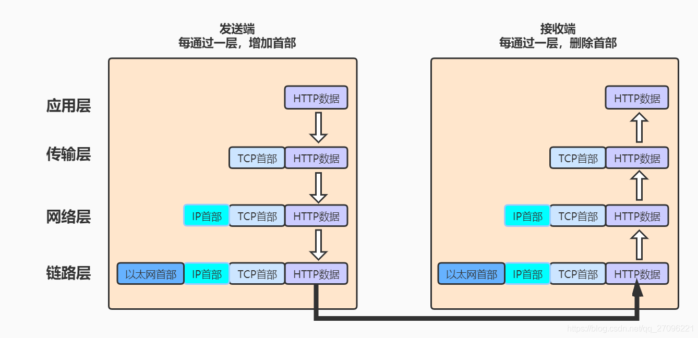

计网,只为速成而生;尽快建立mental model,并解释几个问题:

> 1. 光猫与路由器的关系;各个硬件层面在网络通信中的作用
> 2. SSH加密的作用
> 3. fq及网路底层代理的原理
> 4. TLS加密
> 5. 解决上述知识后进行Ubuntu的ssh设置,解释各步骤的原理
> 6. 何谓选择路由(网路层)?何谓路由?

# 一. 知识系统性归结

([参考](https://blog.csdn.net/qq_27096221/article/details/105599444))

| OSI七层模型 | 经典五层模型 | 功能                               | TCP/IP协议簇                     | 相关设备           |
| ----------- | ------------ | ---------------------------------- | -------------------------------- | ------------------ |
| 应用层      | 应用层       | 文件传输,电子邮件,虚拟终端         | **HTTP**,FTP,SMTP,**DNS,SSH**... |                    |
| 表示层      |              | 数据格式化,代码转换,数据加密       | LPP...                           |                    |
| 会话层      |              | 解除OR建立与别的节点的联系         | SSL,**TLS**                      |                    |
| 传输层      | 传输层       | 提供端对端接口(第一个端对端的层)   | **TCP,UDP**                      |                    |
| 网络层      | 网络层       | 为数据包择路由                     | **IP**,ICMP,ARP,RIP...           | 路由器             |
| 数据链路层  | 数据链路层   | **传输有地址的帧**以及数据检错功能 | SLIP,CSLIP...                    | 交换机,网卡,网桥   |
| 物理层      | 物理层       | 二进制形式在物理媒体上传输数据     |                                  | 集线器,网线,中继器 |




|          | IP地址                                 | MAC地址                        | 端口号                             |
| -------- | -------------------------------------- | ------------------------------ | ---------------------------------- |
| 如何分配 | 管理员分配                             | 写在网卡BIOS上                 | 操作系统分配                       |
| 工作层次 | 网络层                                 | 数据链路层                     | 传输层                             |
| 作用     | 路由器寻址                             | 子网内交换机广播               | 定位计算机中指定进程(服务)         |
| 说明     | 能够找到互联网中目标计算机所在的子网络 | 能够找到子网络中目标网卡(主机) | 找到目标网卡所在计算机中的目标程序 |

只要确定主机和端口，我们就能实现程序之间的交流。因此，Unix系统就把**主机+端口，叫做"套接字"（socket）**。有了它，就可以进行网络应用程序开发了。

总结 ：
IP地址：能够找到互联网中目标计算机所在的子网络
MAC地址：能够找到子网络中**目标网卡(主机)**
端口号：找到目标网卡所在计算机中的目标程序
**通过IP地址，MAC地址和端口号能准确定位到计算中的指定进程(服务)**

局域网中主机之间数据交换：是交换机根据MAC地址表中MAC地址转发的。
互联网中路由器之间数据的转发：是根据IP地址和MAC地址转发的。


`````
public ArrayList<ArrayList<Integer>> levelOrder(TreeNode root) {
        // write code here
        ArrayList<ArrayList<Integer>> result = new ArrayList<ArrayList<Integer>>();
        if(root==null){
            return result;
        }
    
        ArrayList<Integer> partResult = new ArrayList<Integer>();

        ArrayList<TreeNode> queue = new ArrayList<TreeNode>();

        TreeNode last = root;

        queue.add(root);
        TreeNode node;
        while (!queue.isEmpty()) {
            node = queue.remove(0);
            partResult.add(node.val);
            if (node.left != null) {
                queue.add(node.left);
            }
            if (node.right != null) {
                queue.add(node.right);
            }
            if (last == node) {
                result.add(partResult);
                if(!queue.isEmpty()){
                    last = queue.get(queue.size() - 1);
                    partResult = new ArrayList<Integer>();
                    
                }
            }
        }
        return result;
    }
`````

